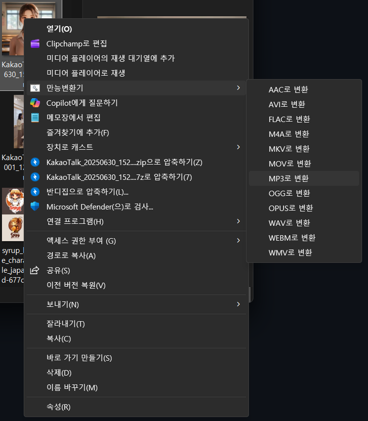

# Sweep ToolBox

**Sweep ToolBox**는 사무직 환경에서 반복적으로 쓰이는 Windows 앱들의 기능을 하나의 데스크톱 앱으로 통합하는 오픈소스 생산성 도구입니다.

- 파일 변환, PDF 편집, 이미지 처리, 데이터 변환 등 흩어진 기능을 **한 곳**에서 사용할 수 있습니다.
- 앱을 열지 않아도 **마우스 우클릭 하나**로 변환이 가능하도록 설계되어, 워크플로를 방해하지 않는 편의성을 목표로 합니다.
- 모든 소스 코드는 **오픈소스**로 공개되어 있습니다.

> 현재 버전은 파일 형식 변환 기능을 중심으로 제공됩니다. 추후 업데이트를 통해 더 많은 편의 기능이 추가될 예정입니다.

## ✨ 주요 기능

- 파일 변환
- 드래그 앤 드롭 및 파일 선택 업로드
- 파일 타입별 변환 포맷 자동 제안
- 단일 변환 / 다중 파일 일괄 변환
- 변환 결과 폴더 열기, 다른 이름으로 저장
- 변환 이력 저장 (최대 200건)
- 전역 품질 설정
  - 영상: CRF, 프레임레이트 모드(CFR/VFR), 오디오 비트레이트
  - 이미지: JPEG 품질, PDF -> 이미지 DPI
- Windows 우클릭 컨텍스트 메뉴 변환 (스크립트 등록)

## 🚀 업데이트 예정 기능 (로드맵)

현재 프로젝트는 컨버터 기능 중심으로 제공되고 있으며, 추후 아래 편의 기능을 순차적으로 업데이트할 예정입니다.

- 바탕화면 노트
- 미리알림
- 이미지 회전
- PDF 병합/분리
- 창 분할
- 파일 검색
- 엑셀 시트 합치기
- 색상 추출 도구

> 위 항목은 기획/개발 상황에 따라 우선순위와 제공 시점이 조정될 수 있습니다.

## 🧩 지원 포맷

- 이미지 입력: `jpg`, `jpeg`, `png`, `gif`, `webp`, `bmp`, `tiff`
- 이미지 출력: `jpg`, `png`, `gif`, `webp`, `bmp`, `tiff`, `pdf`
- 미디어 입력: `mp4`, `avi`, `mkv`, `mov`, `wmv`, `webm`, `flv`, `ts`, `mpeg`, `mpg`, `m4v`, `mp3`, `wav`, `aac`, `flac`, `m4a`, `ogg`, `wma`, `opus`, `aiff`
- 미디어 출력: `mp4`, `avi`, `mkv`, `mov`, `wmv`, `webm`, `mp3`, `wav`, `aac`, `flac`, `m4a`, `ogg`, `opus`
- 문서 입력: `docx`, `pptx`, `hwp`, `hwpx`
- 문서 출력: `pdf`
- PDF 입력: `pdf`
- PDF 출력: `jpg`, `png`, `gif`, `webp`, `bmp`, `tiff`
- 데이터 입력: `csv`, `json`, `xml`
- 데이터 출력: `csv`, `xlsx`, `json`, `xml`
- 엑셀 입력: `xlsx`, `xls`, `xlsm`, `ods`, `tsv`
- 엑셀 출력: `xlsx`, `ods`, `csv`, `tsv`, `json`, `xml`

## 🛠 기술 스택

- Frontend: React 19, Vite, Tailwind CSS, Zustand
- Desktop Shell: Electron
- Backend/Converter: Python (IPC 서버)
- Python 라이브러리: Pillow, ffmpeg-python, pandas, openpyxl, lxml, xlrd, odfpy

## 🗂 프로젝트 구조

```text
converter/
|-- app/                 # Electron + React 앱
|   |-- electron/        # 메인/프리로드/IPC
|   `-- src/             # UI, 페이지, 상태관리
|-- python/              # 변환 로직 및 IPC 서버
|   |-- converters/      # 카테고리별 변환 모듈
|   `-- main.py          # line-delimited JSON IPC 엔트리
|-- scripts/
|   |-- windows/         # 우클릭 메뉴 등록/해제 스크립트
|   `-- macos/
|-- registry_regist.ps1
`-- remove_registry.ps1
```

## 💻 개발 환경 실행

### 1) Python 가상환경 준비

Windows PowerShell 기준:

```powershell
cd python
python -m venv .venv
.\.venv\Scripts\activate
pip install -r requirements.txt
```

> 참고: 루트의 `python_run.ps1`는 가상환경 활성화 명령(`.\python\.venv\Scripts\activate`)만 포함합니다.

### 2) 앱 실행 (개발 모드)

```powershell
cd app
npm install
npm run dev
```

- Vite 개발 서버와 Electron 앱이 함께 실행됩니다.

## 📦 빌드

`app` 디렉터리에서 실행:

```powershell
npm run build        # 전체 빌드
npm run build:win    # Windows용
npm run build:mac    # macOS용
npm run build:python # Python 바이너리(Python 폴더 기준)
```

## 🖱 Windows 우클릭 메뉴 등록/해제

파일 탐색기에서 지원 파일을 우클릭하면 Sweep ToolBox 변환 메뉴가 바로 나타납니다.  
앱을 열 필요 없이 포맷만 선택하면 즉시 변환됩니다.



루트에서 실행:

```powershell
powershell -ExecutionPolicy Bypass -File registry_regist.ps1
powershell -ExecutionPolicy Bypass -File remove_registry.ps1
```

또는 직접 스크립트 실행:

- 등록: `scripts/windows/register-dev.ps1` 또는 `scripts/windows/register.ps1`
- 해제: `scripts/windows/unregister.ps1`

## ⚙ 동작 방식 요약

- Electron 메인 프로세스가 Python 변환 프로세스를 실행합니다.
- Electron <-> Python 간 통신은 stdin/stdout 기반 line-delimited JSON IPC로 처리됩니다.
- UI에서 변환 요청 시 파일 경로/타겟 포맷/설정 옵션을 Python으로 전달합니다.
- 변환 결과를 이력 파일로 저장하고 UI에 반영합니다.

## 📄 라이선스

Sweep ToolBox는 **오픈소스** 프로젝트입니다.  
누구나 소스 코드를 열람하고, 수정하고, 기여할 수 있습니다.  
구체적인 라이선스는 `LICENSE` 파일을 추가해 명시해 주세요.
